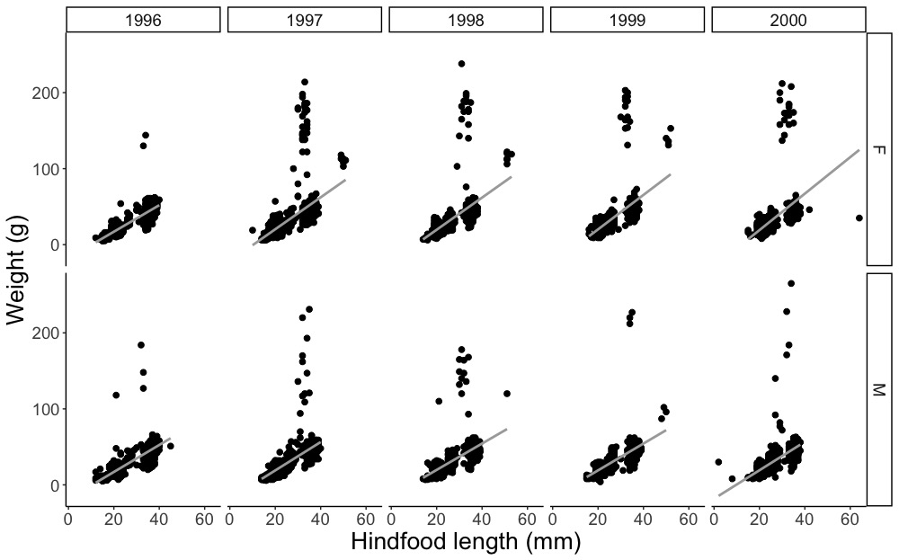

# TidyverseWorkshopFeb2020

## Objectives
<ul style="list-style-type:circle;">
  <li>Read data into RStudio</li>
  <li>Explain the basics of tidyverse and what it is used for</li>
  <li>Create summary statistics for a dataset</li>
  <li>Restructure and manipulate datasets</li>
  <li>Create a box and whisker plot</li>
  <li>Create a scatter plot with a line of best fit</li>
</ul>

This is an introduction to tidyverse and is meant for people with no or limited knowledge of R and RStudio. This 1.5 hour workshop was taught at the University of Arizona Feb. 18, 2020. It was written by Elizabeth Bowman and modified from the DataCarpentry tutorial 'Data Manipulation usign dplyr and tidyr' (https://datacarpentry.org/R-ecology-lesson/03-dplyr.html) to fit the time frame and the audience.

This workshop will have 3 sections:
1. [Basics](01_Basics.Rmd)
<ul style="list-style-type:circle;">
  <li>Learn about tidyverse, R, and RStudio</li>
  <li>Learn about data frames</li>
  <li>Read in our dataset</li>
  
2. [Data manipulation](02_Data_manipulation.Rmd)
  <ul style="list-style-type:circle;">
  <li>Summary statistics</li>
  <li>Restrucruing data using 'pipes'</li>
    
3. [Data visualization](03_Data_visualization.Rmd)
  <ul style="list-style-type:circle;">
  <li>Making a box and whisker plot</li>
  <li>Making a scatter plot</li>
  <li>Addign a linear regression line to a scatter plot</li>

By the end of the worshop, we will manipulate a data file to make the following figure. 

